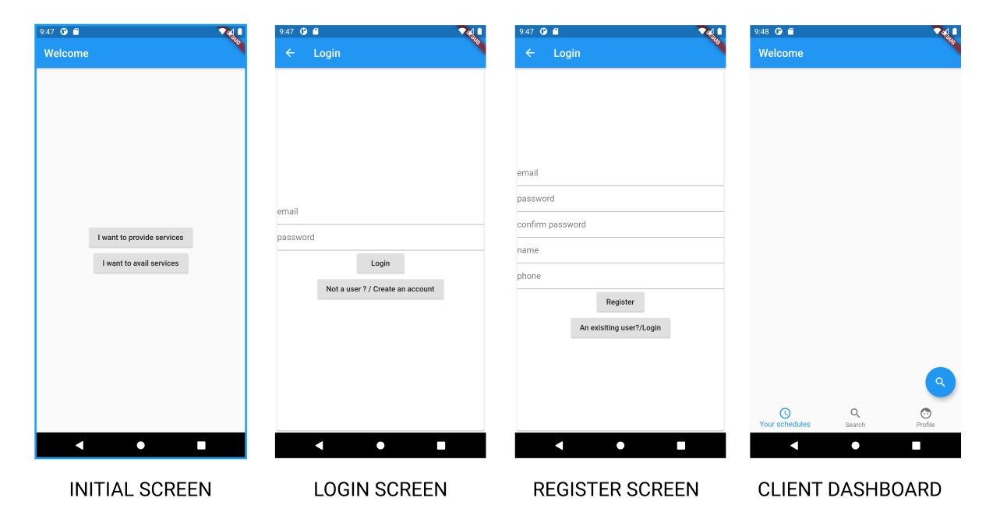
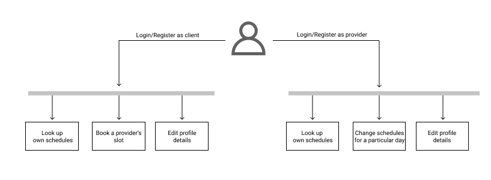
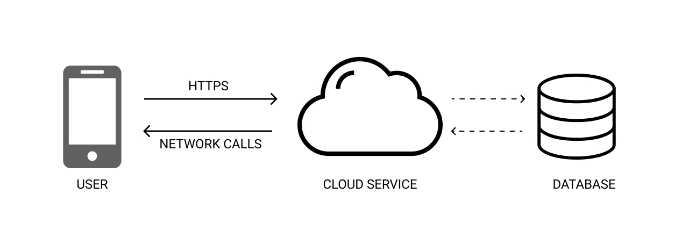

# Calenderly

Calenderly is an app built for users to login, book and avail an agent's services.
This application is completely built using Flutter. Therefore, this app is hybrid aka cross platform. 
It can be deployed and can be run in an Android device as well as an iPhone.

The client will receive a JWT token upon login. The token will be stored in the memory in a secure manner and will be attached to all the requests that the app would make with the server. The JWT token would be responsible for the client's authenticity in the request headers.

## APK

You can find the release APKs in the release/ folder

### About Flutter

A cross platform UI framework kit from Google that encourages fast development and rapid testing.

## NOTE

This application is built as a part of 'Amrita University - Campus hiring 21' by Navigus.

## Screenshots

## Architecture

### Compile this application

In order to compile this application, use the following commands

    git clone https://www.github.com/emilsharier/calenderly
    flutter pub upgrade
    flutter pub get
    flutter run

To build a release APK, use the following command

    flutter build --split-per-abi

## Things/Features left out

Features that I had initally planned on implementing but couldn't finish because of the time constraint.

1. A proper UI. Could have improved the UI/UX if the time permitted for an iterative development. I chose to take on the task with an incremental approach.
2. Provider side screens. Couldn't finish the provider sided screens in time.
    - Provider dashboard
    - Provider calendar
    - Booking schedule